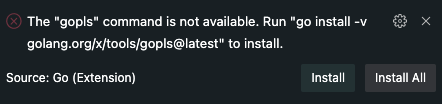

# Study Golang Basic
This will be the first walk thru while studying Golang 😁

Most of this study will be made using VSCode, in a remote Ubuntu machine.

## Golang Instalation

If you don't have golang installed already (`golang --version` returns nothing)
Then you'll have to install golang

```bash
# Remove any previous Go installation
mkdir -p ~/tmp
cd ~/tmp
# you can get this wget link from: https://go.dev/doc/install
wget https://go.dev/dl/go1.19.2.linux-amd64.tar.gz
sudo rm -rf /usr/local/go && sudo tar -C /usr/local -xzf go1.19.2.linux-amd64.tar.gz
rm -f ~/tmp/go1.19.2.linux-amd64.tar.gz
# hopefully you're using zsh too, otherwise change the file to .bashrc =]
grep -qxF 'export PATH=$PATH:/usr/local/go/bin' ~/.zshrc || echo '\n\n# Golang Path\nexport PATH=$PATH:/usr/local/go/bin' >> ~/.zshrc
source ~/.zshrc
go version
```
> [source](https://go.dev/doc/install) - plus some automations

## Hello World

Go to your project folder, in my case: `~/code/study-golang-basic`
```bash
cd ~/code/study-golang-basic
go mod init example/hello
```

Create a file `hello.go` and add the code:  
```go
package main

import "fmt"

func main() {
    fmt.Println("Hello, World!")
}
```
Now let's see if that really works:
```
go run .
```
If in vscode, install the golang extension, plus the gopls:  
  
I've installed in the end:
- gopls
- goimports
- go-outlie

### Run direct from VSCode:
With the `hello.go` file open, you can run the debugger. ⌨️`F5`  
You can also create a launch.json, for running with F5 from any file  
<details>
  <summary>My `launch.json` here</summary>

  ```js
{
    // Use IntelliSense to learn about possible attributes.
    // Hover to view descriptions of existing attributes.
    // For more information, visit: https://go.microsoft.com/fwlink/?linkid=830387
    "version": "0.2.0",
    "configurations": [
        {
            "name": "Launch Package",
            "type": "go",
            "request": "launch",
            "mode": "auto",
            // "program": "${fileDirname}"
            "program": "hello.go"
        }
    ]
}
  ```
</details>
